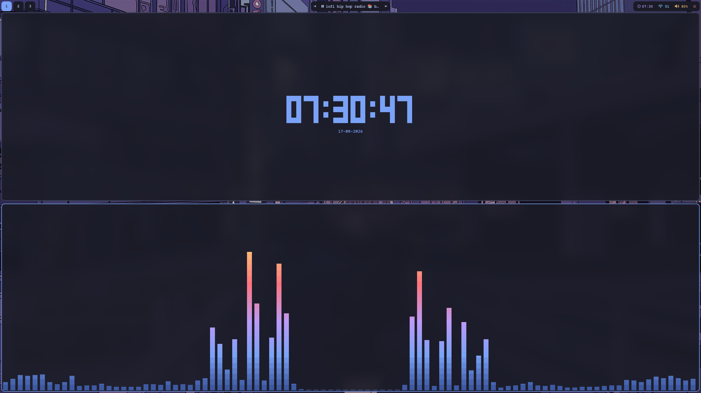

# Dotfiles




### 1. Clone the repo

```bash
git clone https://github.com/ikanop/linux-dotfiles ~/dotfiles
cd ~/dotfiles
```

### 2. Install packages

```bash
sudo pacman -S --needed - < pacman-pkgs.txt
```

### 3. Install yay

```bash
sudo pacman -S --needed git base-devel
git clone https://aur.archlinux.org/yay.git
cd yay
makepkg -si
cd ..
rm -rf yay
```

### 4. Install AUR packages

```bash
yay -S --needed - < aur-pkgs.txt
```

### 5. Stow home configs

```bash
stow home
```

### 6. Stow system configs

```bash
sudo stow -t / keyd
```

### 7. Enable services

```bash
sudo systemctl enable --now keyd
```
