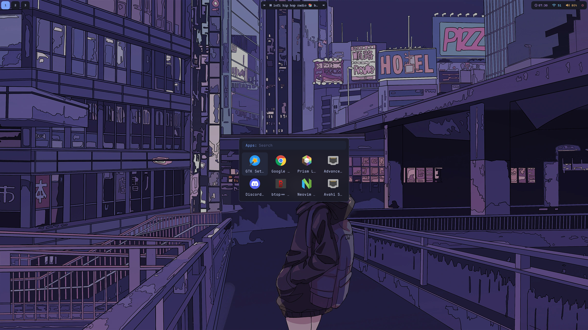
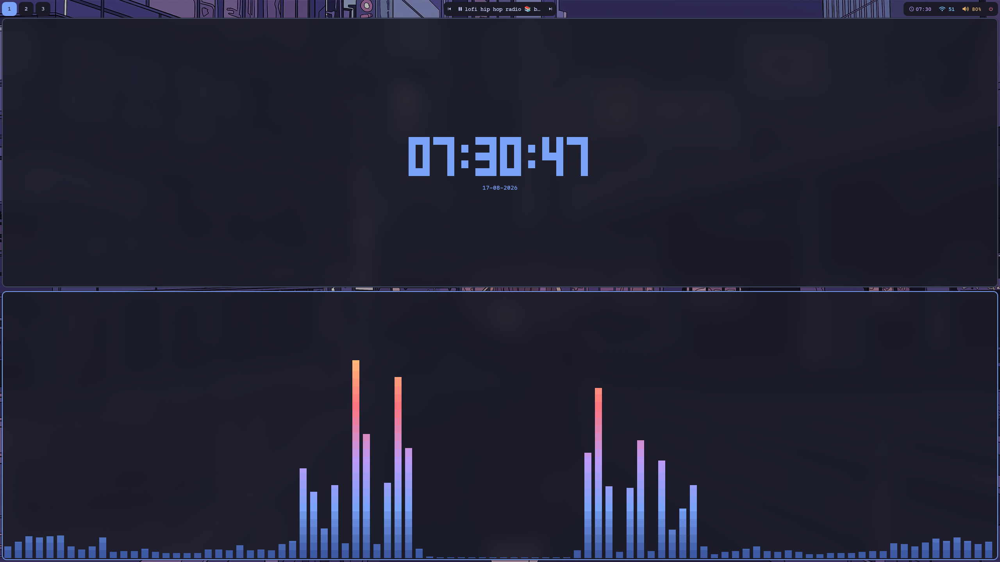

# Dotfiles






### 1. Clone the repo

```bash
git clone https://github.com/ikanop/linux-dotfiles ~/dotfiles
cd ~/dotfiles
```

### 2. Stow home configs

```bash
stow home
```

```
### 3. Install yay

```bash
sudo pacman -S --needed git base-devel
git clone https://aur.archlinux.org/yay.git
cd yay
makepkg -si
cd ..
rm -rf yay
```

### 4. Install theming packages (icons, cursor, font)

```
pacman -Syu nwg-look papirus-icon-theme
yay -Syu bibata-cursor-theme-bin maplemono-nf-unhinted
```
```
```

### 5. Apply the themes

Open `nwg-look`, then set:
- **GTK theme** -> Tokyonight-Dark
- **Icon theme** -> Papirus
- **Cursor theme** -> Bibata-Modern-Ice
